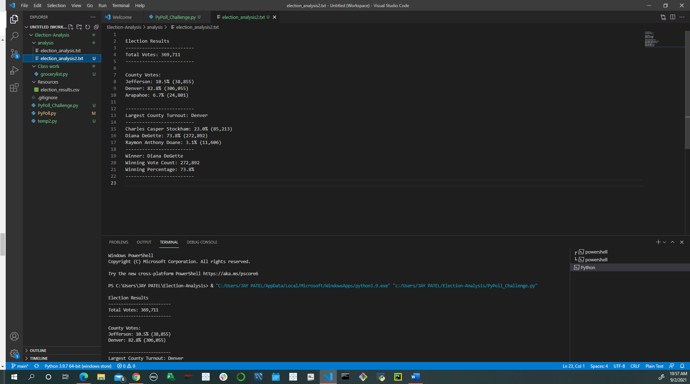

## Project: Election-Analysis for Colorado Board of Elections
## Project Manager: Nayan Patel
## Project Overview:

In this project, our final results will need to be able to deliver the following information 

a) Total number of votes cast

b) The voter turnout for each county

c) The percentage of votes from each county out of the total count

d) The county with the highest turnout

e) A complete list of candidates who received votes

f) Total number of votes each candidate received

g) Percentage of votes each candidate won

h) The winner of the election based on popular vote

## Project Scope:
To provide a written analysis of the election audit for the election commission

## Project Deliverables:

Deliverable 1: The Election Results Printed to the Command Line

Deliverable 2: The Election Results Saved to a Text File

Deliverable 3: A written Analysis of the Election Audit

## Election Analysis

1. Overview of Election Audit:
An election audit is any review conducted after polls close for the purpose of determining whether the votes were counted accurately (a results audit) or whether proper procedures were followed (a process audit), or both.
Both results and process audits can be performed between elections for purposes of quality management, but if results audits are to be used to protect the official election results from undetected fraud and error, they must be completed before election results are declared final.

2. Election Audit Results:

1. Election Audit Summary:

Election Results
-------------------------
Total Votes: 369,711
-------------------------

County Votes:
Jefferson: 10.5% (38,855)
Denver: 82.8% (306,055)
Arapahoe: 6.7% (24,801)

-------------------------
Largest County Turnout: Denver
-------------------------
Charles Casper Stockham: 23.0% (85,213)
Diana DeGette: 73.8% (272,892)
Raymon Anthony Doane: 3.1% (11,606)
-------------------------
Winner: Diana DeGette
Winning Vote Count: 272,892
Winning Percentage: 73.8%
-------------------------

## Challenge Over view:
Looking at the worked performed it was a clear results for election analysis that has determined the winner of this election.

## Challenge Summary
Candidate Diana DeGette win by big margin of 73.8% (272,892) votes.

There are numerous ways in which the integrity of elections can be affected. Election results may be improperly tallied or reported. Inaccuracies may be introduced by human error or because of a lack of proper oversight. Vote counts can be affected if fraudulent voting, e.g., multiple voting, illegal voting, etc., occurs. Election tallies and reporting may also be affected by malicious actors.

This Script is useful and can help more if used with few modifications like
a) Introducing inaccuracies in the recording, maintenance and tallying of votes

b) Counting errors may affect manual or electronic tallying methods. Tallies may be inaccurately reported because of carelessness or malicious activity.
